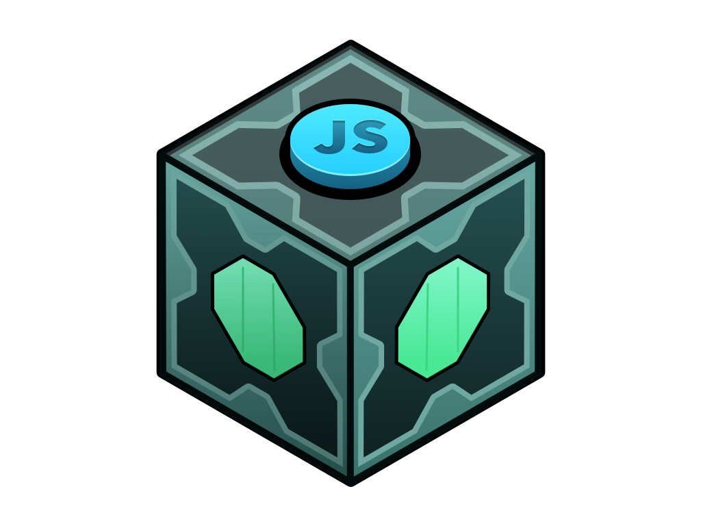

# Meeseeks-js
[](https://badge.fury.io/js/meeseeks-js)
[](https://travis-ci.com/sergioavazquez/meeseeks-js)
[](https://coveralls.io/github/sergioavazquez/meeseeks-js?branch=master)


Useful helper methods for `javaScript` projects.



## Installation

Using npm:
```
$ npm i --save meeseeks-js
```

In order to optimize the size of your code, you can import methods as needed using object destructuring. Keep in mind that Classes start with uppercase by convention, read carefully.

In Node.js:

```
// Load entire build
const mk = require('meeseeks-js');
// Load by method
const { to, mPromise, Watchdog } = require('meeseeks-js');
```

For web (ES6):

```
// Load entire build
import mk from 'meeseeks-js';
// Load by method
import { to, mPromise, Watchdog } from 'meeseeks-js';
```

## to

`to` is used to simplify asynchronous requests.

Normally you would have to use a try/catch block to handle errors:

```
try{
  const result = await(asyncMethod());
}catch(err){
  return errorResponse('Method failed', err)
}
return successResponse(result);
```

Using `to` makes it more readable.

```
const { to } = require('meeseeks-js');

const [err, result] = await to(asyncMethod());
if (err) return errorResponse(err, 'An error occured...');

return successResponse(result);
```

## mPromise

`mPromise` stands for mock promise. Useful for testing asynchronous functions.

`mPromise(time, response, fail)`

- `time` < number > is the time in [ms] that the function will take to resolve or reject. (defaults to 50ms)

- `response` < string > or < function > to resolve/reject when time elapses. If not specified `time` will be resolved or `'fail'` will be used if rejected.

- `fail` < boolean > wether promise is resolved or rejected.


Successfully resolved promise:
```
  const { mPromise } = require('meeseeks-js');

  const expected = 100;
  const result = await mPromise(100);
  expect(result).toEqual(expected);
```

Rejected promise:
```
  const expected = 'rejected';

  mPromise(50, 'rejected', true).then(()=>{
    // should fail
  }).catch(error => {
    expect(error).toEqual(expected);
  })
```

## chain

`chain` resolves promises in a sequential order and returns an array with its results.

`chain(promises)`

- `promises` < promise array >

```
const expected = [150, 700, 100, 50];
const promises = [mPromise(150), mPromise(700), mPromise(100), mPromise(50)];
const result = await chain(promises);
expect(result).toEqual(expected);
```

## debounce

`debounce` allows us to __group__ multiple sequential calls in a single one.

If `leading` is `false` it returns a function, that, as long as it continues to be invoked, will not be triggered. The function will be called after it stops being called for `t` milliseconds.


If `leading` is `true` function will be called once at the leading edge of the event stream but will not be called again until a time `t` goes by without being invoked.


`debounce(function, t, options)`

  - `function` < function >
  - `t` < number > time in milliseconds to wait until execution. Defaults to 200ms.
  - `options` < object > `{leading: < boolean >}` false by default.


It's generally used for optimizations, a classic usage example would be to debounce scroll events.

```
const { debounce } = require('meeseeks-js');
const debouncedFunction = debounce(checkPositionAndDoSomething(), 150);
window.addEventListener('scroll', debouncedFunction);
```
_Why?_

If not debounced `checkPositionAndDoSomething` would probably be invoked and executed many more times than it needs to. Of course that depends on specifics of each implementation but [here's a codepen](https://codepen.io/dcorb/pen/PZOZgB) that shows how many scroll events are triggered when scrolling.


## Store

`Store` is a helper method I use to share information accross integration tests. If set up as a sinlgeton it can share information across different files.

`Store` is a class that's why it starts with uppercase.

```
  const { Store } = require('meeseeks-js');
  const storage = new Store();
  const response = await logUserIn();
  storage.setByKey('token', extractToken(response));
```
...
```
 const response = await request(app)
      .get('/some/resource/')
      .set('Accept', 'application/json')
      .set('Authorization', storage.getByKey('token'))
```

It has three methods:

`setByKey(key, value)`
 - `key` < string >
 - `value` Anything.

`getByKey(key)` Gets stored value by key.

`clear()` Clears storage.

## Watchdog

`Watchdog` is a function that triggers a specified `trigger function` in a certain amount of `time` unless it's reset or cancelled.

It's very common en embedded systems, more [info here.](https://en.wikipedia.org/wiki/Watchdog_timer)

I've used it for controlling event execution that can be cancelled or extended depending on user interaction.

i.e. Hide mouse cursor and UI when reproducing a video if there are no mouse movements within 5 seconds.

// Pseudocode:
```
const { Watchdog, debounce } = require('meeseeks-js');

const wd = new Watchdog(5 * 1000, hidePlayerUI);
// debounce is added for performance.
const postpone = debounce(wd.reset());
const eL = document.addEventListener('mousemove', postpone);
wd.start();

```

Every time user moves the mouse timer gets reset to the default time.

`Watchdog` is a class.

`Watchdog(timer, triggerFcn, options)`

  - `timer` < number > expressed in [ms].
  - `triggerFcn` < function >
  - `options` < Object > So far it only has one property.
  `{once: boolean}` if `true` triggerFcn is only triggered once. Defaults to false.

Methods:

- `start()` This method starts the timer. Required.
- `cancel()` This method cancels the timer.
- `reset(time)` This method pushes the function trigger `time` [ms]. If `time` is not provided, `Watchdog` defaults to the timer set during initialization.

Properties:

- `wd.triggerCount` number of times triggerFcn has been triggered.


## Development

`clone or fork repository`
```
npm install

npm run test:unit // Runs unit tests and generates coverage report.
npm run test:int // Runs integration tests against built library.
npm run test:dev // Runs tests while allowing attaching an inspector for debugging.
npm run build // Compiles librabry.
npm run lint // Lints code.
```

Like the logo? Check out more cool design stuff by Gonzalo Cervantes [here!](https://dribbble.com/Cervantes)